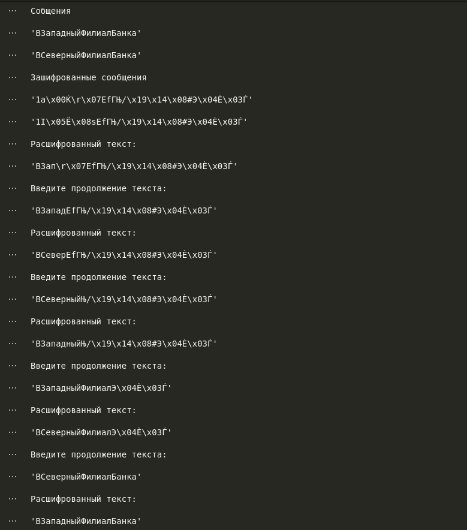

---
## Front matter
lang: ru-RU
title:  Основы информационной безопасности. Лабораторная работа № 8
subtitle: Элементы криптографии. Шифрование (кодирование) различных исходных текстов одним ключом
author: |
	Демидова Е.А.
institute: Российский Университет дружбы народов
date: 09.09.2023

## i18n babel
babel-lang: russian
babel-otherlangs: english

## Formatting pdf
toc: false
toc-title: Содержание
slide_level: 2
aspectratio: 169
section-titles: true
theme: metropolis
header-includes:
 - \metroset{progressbar=frametitle,sectionpage=progressbar,numbering=fraction}
 - '\makeatletter'
 - '\beamer@ignorenonframefalse'
 - '\makeatother'
---

# Информация

## Докладчик

:::::::::::::: {.columns align=center}
::: {.column width="70%"}

  * Демидова Екатерина Алексеевна
  * студентка группы НКНбд-01-21
  * Российский университет дружбы народов
  * <https://github.com/eademidova>

:::
::: {.column width="30%"}


:::
::::::::::::::

# Вводная часть

## Цели и задачи

**Целью** данной работы является освоить на практике применение режима однократного гаммирования на примере кодирования различных исходных текстов одним ключом

**Задание:**

Два текста кодируются одним ключом (однократное гаммирование). Требуется не зная ключа и не стремясь его определить, прочитать оба текста. Необходимо разработать приложение, позволяющее шифровать и дешифровать тексты P1 и P2 в режиме однократного гаммирования. Приложение должно определить вид шифротекстов C1 и C2 обоих текстов P1 и P2 при известном ключе ; Необходимо определить и выразить аналитически способ, при котором злоумышленник может прочитать оба текста, не зная ключа и не стремясь его определить.

**Инструмент:** Python

# Выполнение лабораторной работы

## Функции для реализации однократного гаммирования

```py
def key_gen(text):
    alph = [chr(i) for i in range(1040,1104)] + [chr(i) for i in range(33,64)]
    key = "".join([random.choice(alph) for i in range(len(text))])
    return key

def encryption(text, key):
    return "".join([chr(ord(key[i])^ord(text[i])) for i in range(len(key))])
```

## Шифрование и дешифрование методом однократного гаммирования

```py
P1 = "ВЗападныйФилиалБанка"
P2 = "ВСеверныйФилиалБанка"
key = key_gen(P1)
C1 = encryption(P1, key)
C2 = encryption(P2, key)
```

## Способ расшифровки текстов без знания ключа

$$
C1 \oplus C2 \oplus P1 = P1 \oplus P2 \oplus P1 = P2
$$

## Способ расшифровки текстов без знания ключа

```py
fragment = "ВСев"

msg2 = fragment
c1, c2 = C1, C2
length = len(msg2)
while length <= len(P1):
    C12 = encryption(C1[:length], C2[:length])
    msg1 = encryption(C12, msg2) 
    print("Расшифрованный текст:")
    display(msg1 + c1[length:])
    print("Введите продолжение текста: ")
    msg1 += input()
    length = len(msg1)
    display(msg1 + c1[length:])
    
    msg1, msg2 = msg2, msg1
    c1, c2 = c2, c1
```

## Результаты

{#fig:001 width=50%}

# Заключение

## Выводы

В результате выполнения работы были освоены практические навыки применения режима однократного гаммирования на примере кодирования различных исходных текстов одним ключом

## Список литературы

1. Ященко В. В. Введение в криптографию. МЦНМО, 2017. 349 с.